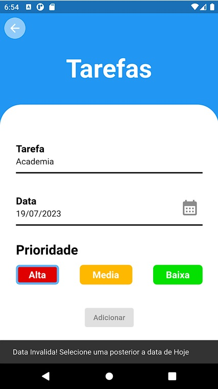
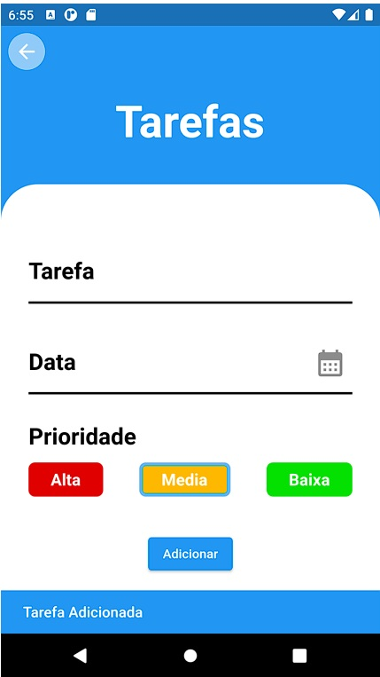
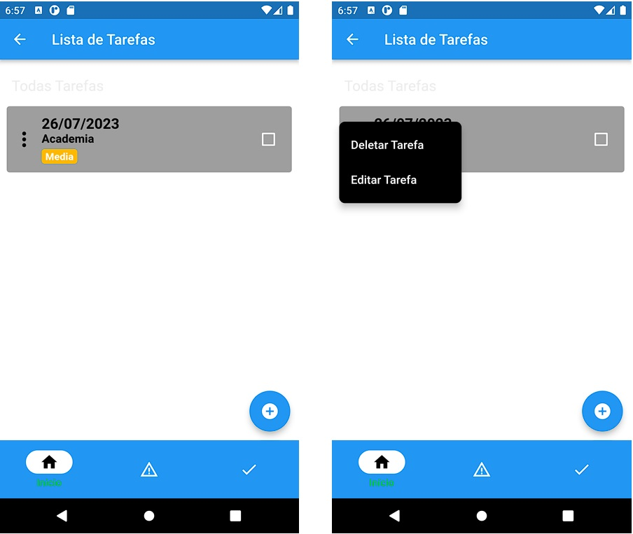

# ToDO

## How to setup

Steps to run the project locally:

## Building from Source

1. If you don't have Flutter SDK installed, please visit official [Flutter](https://flutter.dev/) site.
2. Fetch latest source code from master branch.

```
git clone https://github.com/moraisacr/todo_flutter
```

3. Run the app with Android Studio or VS Code. Or the command line:

```
flutter pub get
flutter run
```

## Todo list app using Flutter implemented with Hive DB for database (CRUD).


## Features
#### Basic
- [x] Task creation.
- [x] Task editing.
- [x] Task deletion.
- [x] Mark as Important
- [x] Mark as Date.
- [x] Mark as Done.


## Packages we are using:


[hive](https://pub.dev/packages/hive) | Lightweight and blazing fast key-value database written in pure Dart.
<br>
[hive_flutter](https://pub.dev/packages/hive_flutter) | Extension for Hive. Makes it easier to use Hive in Flutter apps.

<p align="center">
  
  
</p>
<p align="center">
  
</p>
